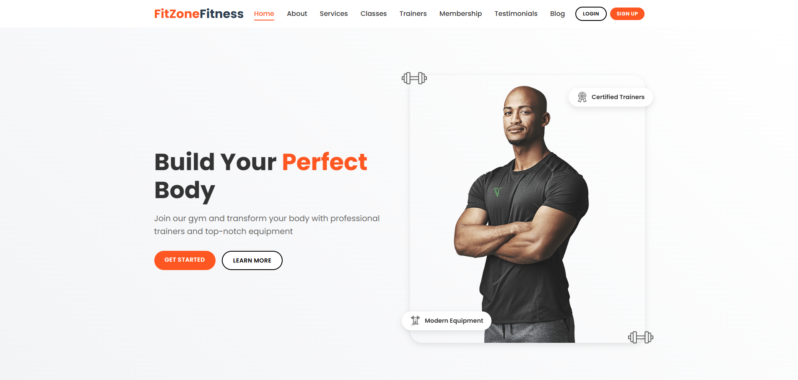
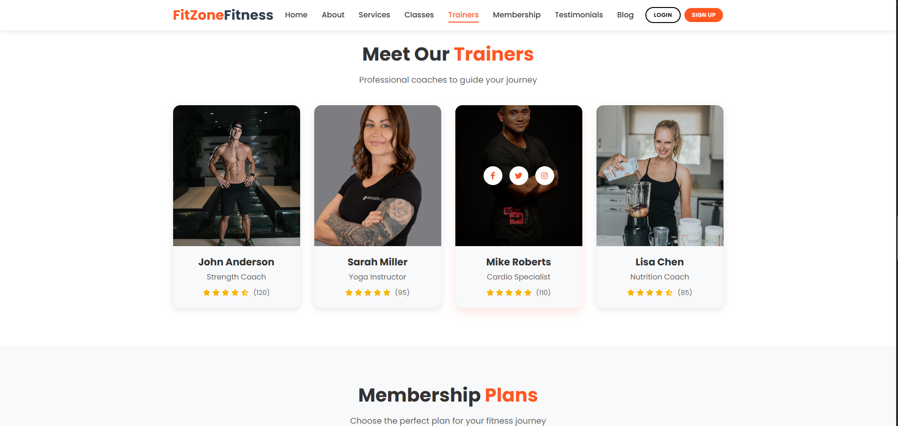
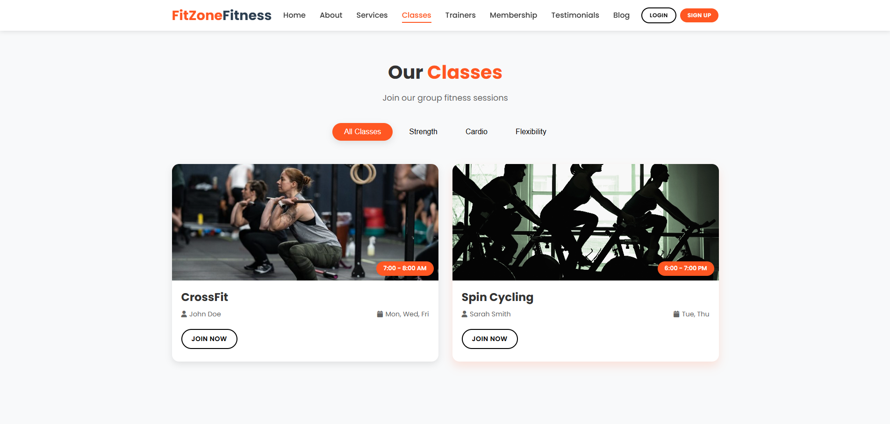
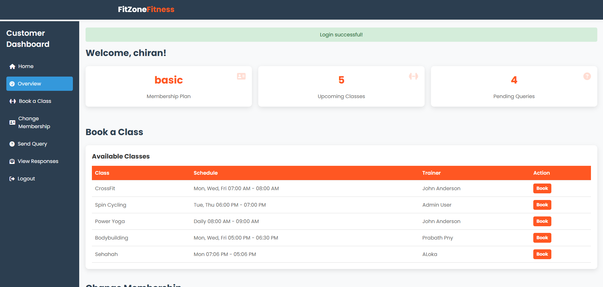
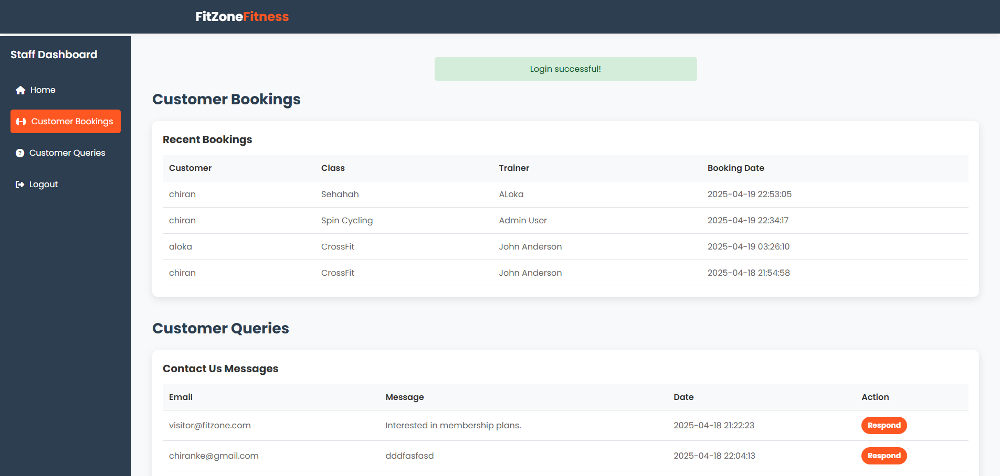
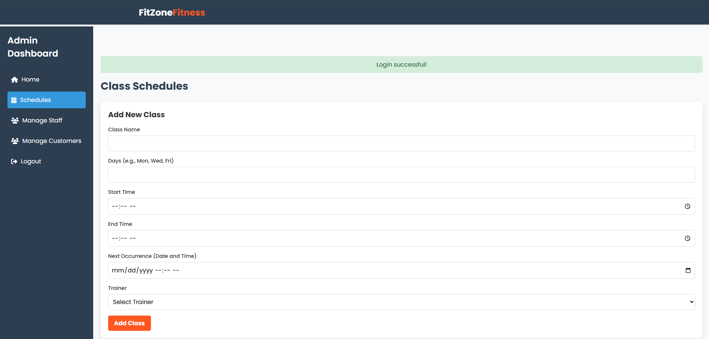

# 🏋️‍♂️ FitZone Gym — Web Application
A modern **white & orange themed** fitness center web application.  
Includes Customer, Staff, and Admin dashboards with smooth UI interactions.

---

## 🚀 Overview
FitZone Gym is a responsive web application built to manage:

- Customer registrations  
- Membership & gym programs  
- Class schedules  
- Trainer profiles  
- Staff operations  
- Admin management  

This project focuses on providing a clean, modern UI with smooth interactions and fully responsive pages.

---

## 🎨 Features

### ⭐ General
- Clean **White + Orange UI**
- Responsive for all devices
- Smooth animations (GSAP)
- Swiper sliders
- Scroll-to-top button
- Preloader animation

### 👤 Customer
- Online registration
- Login system
- View membership plans
- View classes & schedules
- View trainers
- Send inquiries
- Read blog posts

### 🧑‍💼 Staff
- Manage inquiries
- View appointments
- View customer info

### 🛡️ Admin
- Manage staff accounts
- Manage class schedules
- Manage trainers
- Manage membership plans

---

## 🧰 Tech Stack

**Frontend**
- HTML5  
- CSS3 (White + Orange Theme)  
- JavaScript  
- GSAP  
- SwiperJS  

**Backend**
- PHP  
- MySQL  

---

## 🖼️ Project Screenshots

### 🔥 Dashboard Previews

<table>
  <tr>
    <td align="center"><b>🏠 Home Page</b></td>
    <td align="center"><b>💪 Trainers</b></td>
  </tr>
  <tr>
    <td></td>
    <td></td>
  </tr>

  <tr>
    <td align="center"><b>📅 Classes</b></td>
    <td align="center"><b>💼 Membership Plans</b></td>
  </tr>
  <tr>
    <td></td>
    <td></td>
  </tr>

  <tr>
    <td align="center"><b>⭐ Reviews</b></td>
    <td align="center"><b>👤 Customer Dashboard</b></td>
  </tr>
  <tr>
    <td></td>
    <td></td>
  </tr>

  <tr>
    <td align="center"><b>🧑‍💼 Staff Dashboard</b></td>
    <td align="center"><b>🛡️ Admin Dashboard</b></td>
  </tr>
  <tr>
    <td></td>
    <td></td>
  </tr>
</table>

---

## 📝 Project Goals
- Provide FitZone a professional web presence  
- Make customer onboarding easier  
- Reduce manual work for staff  
- Give admin full control  
- Support future backend development  

---

## 🚧 Future Enhancements
- Backend system (PHP + MySQL)
- Attendance tracking
- Payment gateway
- Class booking system
- Dashboard analytics
- Workout generator
- AI recommendations

---

## 👨‍💻 Author
**Chiran Keshawa Weerasekara**  
Software Engineering Student  
📧 Email: *chiranke@gmail.com*

---

